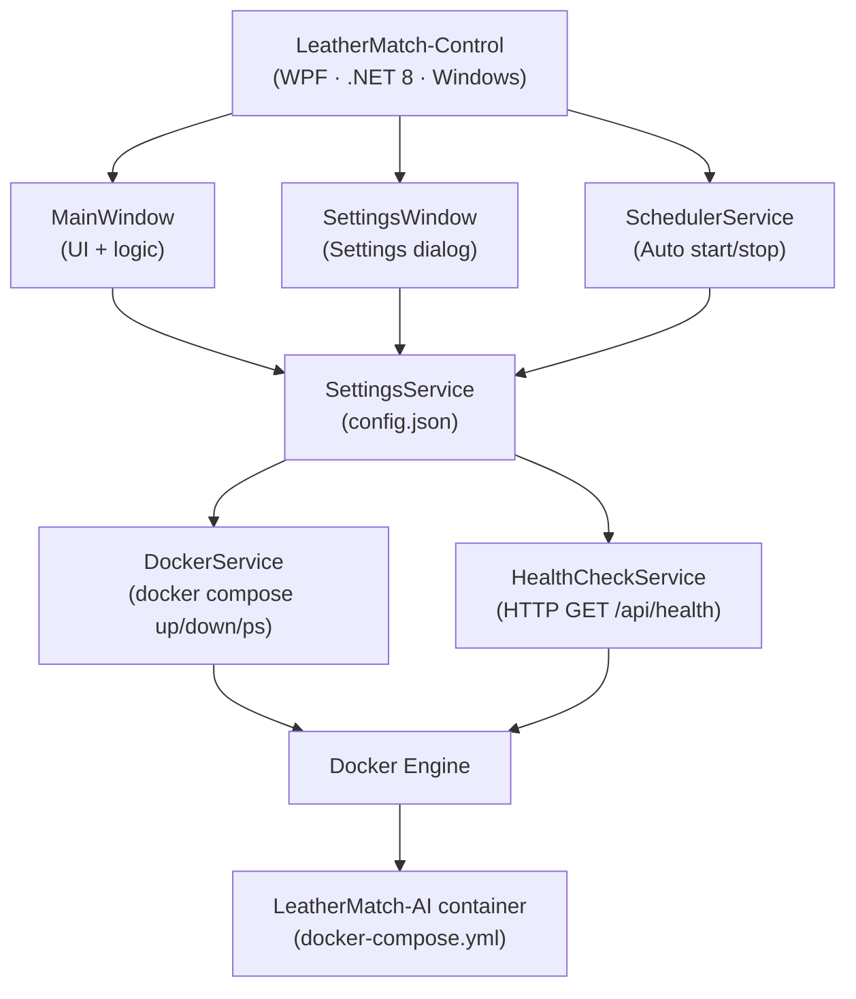
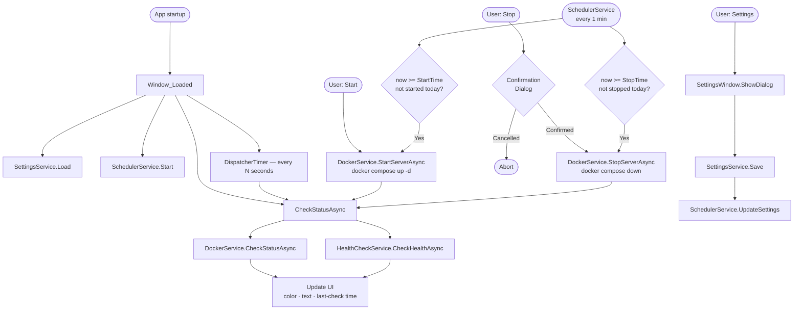

## LeatherMatch-Control

Offline-first Windows control panel for managing the **LeatherMatch-AI** Docker service — start, stop, and monitor the AI server from a simple WPF UI, no command line required.

---

## LeatherMatch Ecosystem

The LeatherMatch system consists of two separate repositories:

| Repository | Stack | Role |
|---|---|---|
| LeatherMatch-AI | Java · Python · React · Docker | AI inference server + web UI |
| **LeatherMatch-Control** *(this repo)* | C# · WPF · .NET 8 · Windows | Desktop control panel for managing the AI service |

LeatherMatch-AI provides a `docker-compose.example.yml` that you copy and adapt on the host machine where **LeatherMatch-Control** runs. The WPF app then points to the folder containing your `docker-compose.yml` and controls the service via Docker Compose.

---

## Features

- **Server control** – Start / stop the LeatherMatch-AI service via Docker Compose with a single click.
- **Health monitoring** – Query a configurable HTTP health endpoint to determine server status.
- **Auto refresh** – Poll server status at a configurable interval (default: 15 s).
- **Scheduled start/stop** – Automatically start and stop the service at configured daily times.
- **Settings UI** – Configure Docker Compose directory, health check URL, and schedule from the UI.
- **Visual status indicator** – Color‑coded ellipse showing live server state (green / red / yellow / gray).

---

## Requirements

| Requirement | Minimum Version |
|---|---|
| Operating System | Windows 10 (x64) |
| .NET Runtime | .NET 8.0 (Windows) |
| Docker Desktop | Docker Engine + Compose V2 |

> **Note:** Docker Desktop must be running and the `docker compose` command must be accessible on PATH.

---

## Getting Started

### Clone

```powershell
git clone https://github.com/your-org/LeatherMatch-Control.git
cd LeatherMatch-Control
```

### Build

```powershell
# Debug build
dotnet build .\LeatherMatchControl.sln -c Debug

# Release build
dotnet build .\LeatherMatchControl.sln -c Release
```

### Run

```powershell
# Via dotnet run
dotnet run --project "src\LeatherMatchControl\LeatherMatchControl.csproj"

# Via compiled executable (Release)
& "src\LeatherMatchControl\bin\Release\net8.0-windows\LeatherMatchControl.exe"
```

### First-time configuration

On first launch, a `config.json` file is created with default values.  
Click the **Settings** button to configure it for your environment:

| Setting | Description | Default |
|---|---|---|
| Docker Compose Directory | Folder containing `docker-compose.yml` (copied from `docker-compose.example.yml` in LeatherMatch-AI) | `C:\LeatherMatch` |
| Health Check URL | Service health endpoint used for monitoring | `http://localhost:8080/api/health` |
| Auto Refresh Interval | Status polling frequency in seconds | `15` |
| Auto Start | Automatically start the service at a configured daily time | Disabled |
| Auto Stop | Automatically stop the service at a configured daily time | Disabled |

---

## High-level architecture



---

## Application flow



---

## Project structure

```
LeatherMatch-Control/
├── LeatherMatchControl.sln
└── src/
    └── LeatherMatchControl/
        ├── LeatherMatchControl.csproj
        ├── App.xaml / App.xaml.cs          # Application entry point
        ├── MainWindow.xaml                 # Main control panel UI
        ├── MainWindow.xaml.cs              # Main window logic
        ├── SettingsWindow.xaml             # Settings dialog
        ├── SettingsWindow.xaml.cs
        ├── config.json                     # User configuration (copied to output; not tracked in git)
        ├── Assets/
        │   └── app-icon.ico                # Application icon
        ├── Models/
        │   ├── AppSettings.cs              # Settings data model
        │   └── ServerStatus.cs             # Server status enum
        └── Services/
            ├── DockerService.cs            # Docker CLI wrapper
            ├── HealthCheckService.cs       # HTTP health probe
            ├── SettingsService.cs          # config.json read/write
            └── SchedulerService.cs         # Automatic start/stop scheduler
```

---

## Data model

### `config.json`

```json
{
  "ComposeWorkingDirectory": "C:\\LeatherMatch",
  "HealthCheckUrl": "http://localhost:8080/api/health",
  "AutoRefreshIntervalSeconds": 15,
  "AutoStartEnabled": false,
  "AutoStopEnabled": false,
  "StartTime": "09:00",
  "StopTime": "18:00"
}
```

### `ServerStatus` enum

| Value | Indicator Color | Description |
|---|---|---|
| `Running` | Green | Service is running and healthy |
| `Stopped` | Red | Service is stopped |
| `Starting` | Yellow | Service is starting up |
| `Unknown` | Yellow | Status cannot be determined |
| `Error` | Gray | An error occurred |

---

## Tech stack

| Layer | Technology |
|---|---|
| Language | C# 12 |
| Target Framework | .NET 8 (`net8.0-windows`) |
| UI Framework | WPF (Windows Presentation Foundation) |
| Additional UI | Windows Forms (`FolderBrowserDialog`) |
| Serialization | `System.Text.Json` |
| HTTP | `System.Net.Http.HttpClient` |
| Process Control | `System.Diagnostics.Process` |
| Scheduling | `System.Windows.Threading.DispatcherTimer` |
| External Packages | None (pure BCL) |

---

## License

Copyright (c) 2026

This desktop application is provided for **portfolio and demonstration purposes only**.  
Commercial use, redistribution, and production deployment are prohibited without prior written permission.  
See `LICENSE` for the full license text.

